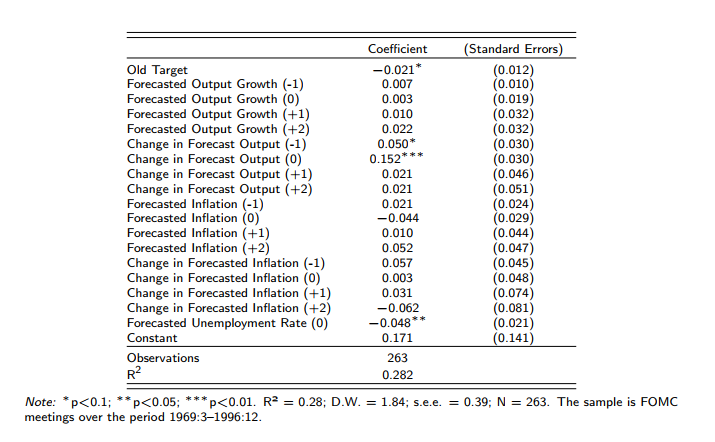
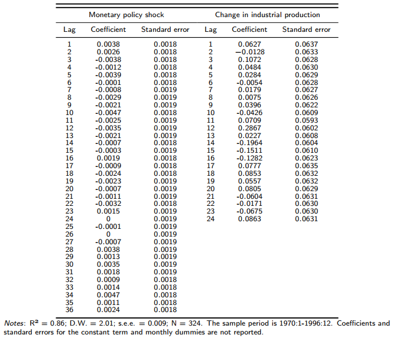

```{r setup, include=FALSE}
knitr::opts_chunk$set(warning = FALSE, message = FALSE)
```

## Introduction

For this replication, we had access to the authors replication kit and for the extension of the analysis period we used data made available by Ramey. However, we weren't able to replicate all the figures using the latter, moreover, since the extension to the Brazilian data involved reading the equivalent meetings from the FOMC institution in the national context, COPOM, we didn't extended the replication for this setting.

## Original sample

The original sample runs from 01:1966 to 12:1996, however, due to lag structure of the models, the authors use the sample from 01:1970 to run the regressions.

### Deriving the new measure of policy shocks

To derive it, we run the following regression and retrieve the residuals, which will be this new measure:

```{r}

```


where:

- $\Delta ff_m$: change in intended funds rate at meeting $m$;
- $ffb_m$: levels *before* the meeting;
- $\Tilde{X} = \{\Tilde{\Delta y}, \Tilde{\pi}, \Tilde{u} \}$: forecasts of output (growth), inflation, and unemployment respectively;
- $i$: quarter $\implies$ they account for forecasts prior and after the meetings;
- [$\implies$] $\epsilon_m$: the new measure of monetary shocks.

*Table 1: Determinants of the Change in the Intended Funds Rate*

```{r}

```

*Table 2: New Measure of Monetary Policy (\% points)*

```{r}

```

```{r}
source('I_derivation_of_a_new_measure_of_monetary_policy_shocks.R')
```

### Implications of the new measure

#### Output

Now, for the implication on output, we run:

```{r, out.width="50%"}

```

where:

- $\Delta y_t$: output growth in month $t$ proxied by industrial production;
- $D_{kt}$: month dummies (seasonality) for each month $k$;
- $S_t$: new measure of monetary shock.


*Table 3: The Impact of Monetary Policy Shocks On Industrial Production*

```{r}

```

```{r}
source("II_implications_new_measure_a_output.R")
```

#### Prices

And for prices, as before, but now:

```{r}

```

where:

- [...] $\Delta p_t$: inflation.
- [obs.:] Also some more lags to $S$.

*Table 4: The Impact of Monetary Policy Shocks On Prices*

```{r}

```

```{r}
source("II_implications_new_measure_b_prices.R")
```

#### Supply Shocks

```{r}
source("II_implications_new_measure_c_supply_shocks.R")
```

### VAR

```{r}
source("II_implications_new_measure_d_var.R")
```


## Extension

Ramey provides data to extended the analysis up until to 12:2007. As it can be seen below, conclusions kept the same

For the output implication:

*Table 1*

```{r}

```

```{r}
source("II_implications_new_measure_a_extended_output.R")

```

Now, for the VAR extension:

```{r}
source("II_implications_new_measure_d_extended_var.R")
```


## Critical Review

The paper succinctly highlights a crucial point: simplicity can convey profound significance. By simply trying to observe who was taking decisions and why enable the authors to solve a long debate in the literature regarding how monetary policy decisions can affect the economic landscape, as the theory suggest, but empirically has proven to be a challenging task to show. However, some of the empirical decisions seen to be defined _ad hoc_, although making it possible to present results in a simple fashion, it fails to address concerns for the robustness of the findings.

Moreover, the approach to control for supply shocks through commodity prices, while logical, faces scrutiny, notably due to its absence in the initial model specification. This methodological inconsistency raises concerns about the efficacy of such controls. Although intended to moderate the impulse response of monetary policy on output and price levels, the retrospective application of this control mechanism implies potential deficiencies in the initial model design. Future research should prioritize integrating supply shock controls into the initial model to accurately verify their mitigating effects.

Finally, the incorporation of a var(36) model, encompassing output, price, and the novel monetary policy measure, falls short of offering novel insights, with the issue of lag selection remaining unresolved. The interpretation challenges associated with the Impulse Response Function (IRF) suggest a possibly reactive model specification, potentially influenced by external feedback rather than a solid theoretical foundation. This scenario underscores the need for a more principled approach in model selection and specification, ensuring that methodological choices are guided by theoretical rigor and empirical justification.